# ATS Resume Builder

> Plataforma de criação e personalização de currículos com Inteligência Artificial, desenvolvida com Lovable.

O **ATS Resume Builder** é uma aplicação web criada para auxiliar profissionais no processo de candidatura a vagas de emprego.

A aplicação permite centralizar informações profissionais, analisar a compatibilidade entre o perfil do candidato e uma vaga, identificar requisitos atendidos e lacunas, gerar um currículo personalizado para a oportunidade e exportá-lo em PDF.

O projeto foi desenvolvido utilizando **Lovable**, com uma abordagem orientada por prompts e desenvolvimento incremental.

---

## 🚀 Aplicação

**Acesse a aplicação publicada:**

👉 **[ATS Resume Builder — Aplicação](https://ats-builder-resume.lovable.app/)**

A aplicação está publicada e pode ser acessada pelo endereço acima.

---

## 🎯 Problema que a aplicação resolve

Ao se candidatar a diferentes vagas, é comum que o profissional precise adaptar seu currículo manualmente para cada oportunidade.

Esse processo pode ser demorado e gerar algumas dificuldades:

- Identificar quais requisitos da vaga já são atendidos;
- Entender quais competências estão faltando ou não estão evidenciadas;
- Decidir quais experiências e projetos devem ser destacados;
- Adaptar o resumo profissional para cada oportunidade;
- Selecionar as competências mais relevantes;
- Manter diferentes versões de currículo;
- Garantir que o currículo contenha termos relevantes para sistemas ATS;
- Repetir esse processo para cada nova candidatura.

O ATS Resume Builder foi criado para centralizar essas informações e automatizar parte desse processo utilizando Inteligência Artificial, mantendo o usuário no controle das informações utilizadas.

---

## 💡 Objetivo

O objetivo da aplicação é transformar o processo de criação de um currículo direcionado a uma vaga em um fluxo único:

```text
Informações profissionais
        ↓
Descrição da vaga
        ↓
Análise dos requisitos
        ↓
Compatibilidade com o perfil
        ↓
Identificação de lacunas
        ↓
Sugestões de melhoria
        ↓
Currículo personalizado
        ↓
Revisão pelo usuário
        ↓
Exportação em PDF
```

A aplicação não tem como objetivo prever a possibilidade de contratação.

O percentual apresentado representa a **correspondência entre as informações fornecidas pelo usuário e os requisitos identificados na descrição da vaga**.

---

# ✨ Funcionalidades

## 👤 Perfil profissional

O usuário possui um perfil centralizado que pode ser reutilizado em diferentes candidaturas.

O perfil possui as seguintes seções:

- Dados pessoais e resumo profissional;
- Experiências profissionais;
- Formação acadêmica;
- Certificações e cursos;
- Competências;
- Idiomas;
- Projetos.

Todas as informações podem ser cadastradas, editadas e salvas na aplicação.

Esses dados servem como uma das fontes utilizadas para a análise das vagas e geração dos currículos.

---

## 📄 Utilização de currículo existente

Além de utilizar o perfil salvo, o usuário pode iniciar uma candidatura colando o conteúdo de um currículo existente.

A Inteligência Artificial interpreta o conteúdo e organiza as informações encontradas nos campos correspondentes do perfil.

Após a interpretação, o usuário pode revisar os dados extraídos antes de utilizá-los.

Também é possível escolher quais informações ainda não estão cadastradas no perfil devem ser salvas permanentemente.

---

## 💼 Cadastro de vagas

O usuário pode cadastrar oportunidades de emprego informando:

- Título da vaga;
- Nome da empresa;
- Link da vaga;
- Descrição completa;
- Observações pessoais.

Também é possível salvar uma vaga como rascunho antes de realizar a análise.

As vagas cadastradas ficam disponíveis na área de vagas para consulta e acompanhamento.

---

## 🤖 Análise de compatibilidade

A aplicação utiliza Inteligência Artificial para analisar a descrição da vaga e compará-la com as informações profissionais utilizadas na candidatura.

A análise apresenta:

- Percentual de compatibilidade;
- Resumo da análise;
- Requisitos atendidos;
- Requisitos parcialmente atendidos;
- Requisitos não identificados;
- Sugestões de melhoria.

A análise também apresenta evidências relacionadas ao perfil sempre que disponíveis.

### Classificação dos requisitos

**Atendido**

Existe evidência suficiente nas informações fornecidas para considerar que o requisito é atendido.

**Parcialmente atendido**

Existem experiências ou competências relacionadas, mas as informações disponíveis não são suficientes para considerar o requisito totalmente atendido.

**Não identificado**

Não foram encontradas informações suficientes no perfil utilizado para confirmar o requisito.

A classificação **"Não identificado" não significa necessariamente que o candidato não possui aquela competência**. Ela indica que não existem evidências suficientes nas informações utilizadas na análise.

---

## 📊 Match da vaga

O percentual de compatibilidade é calculado a partir dos requisitos identificados na descrição da vaga e de seus respectivos níveis de atendimento.

Os requisitos possuem pesos diferentes de acordo com sua importância, permitindo que requisitos obrigatórios tenham maior influência no resultado do que requisitos desejáveis.

O cálculo é realizado a partir dos requisitos analisados, em vez de permitir que a Inteligência Artificial simplesmente escolha um percentual arbitrário.

O resultado deve ser interpretado como um indicador de correspondência entre o perfil informado e a vaga, e não como uma previsão de contratação.

---

## 📝 Geração de currículo personalizado

Após analisar a vaga, o usuário pode solicitar a geração de um currículo direcionado àquela oportunidade.

A aplicação utiliza como base:

- Dados profissionais selecionados;
- Descrição da vaga;
- Requisitos identificados;
- Resultado da análise;
- Competências relacionadas;
- Experiências relevantes;
- Projetos relevantes.

O currículo é adaptado para destacar as informações mais relacionadas à oportunidade.

A aplicação evita incluir informações irrelevantes e permite que o usuário revise o conteúdo antes da exportação.

---

## ✏️ Revisão do currículo

Depois da geração, o usuário pode revisar e editar o currículo.

É possível ajustar informações como:

- Resumo profissional;
- Experiências;
- Competências;
- Projetos;
- Formação;
- Certificações;
- Idiomas;
- Informações de contato.

O usuário mantém o controle sobre o conteúdo final antes de gerar o documento.

---

## 📥 Exportação em PDF

Após revisar o currículo, o usuário pode exportá-lo em PDF.

O documento possui uma estrutura simples e organizada, priorizando:

- Legibilidade;
- Estrutura textual;
- Hierarquia clara das informações;
- Compatibilidade com leitura automatizada;
- Facilidade de utilização em processos seletivos.

A aplicação evita elementos visuais que possam dificultar a interpretação do conteúdo por sistemas ATS.

---

# 🖥️ Demonstração da aplicação

A seguir estão alguns dos principais momentos da utilização do ATS Resume Builder.

As imagens foram organizadas para demonstrar o funcionamento da aplicação como uma história, desde o primeiro acesso até a geração do currículo.

---

## 1. Página inicial

A página inicial apresenta a proposta do ATS Resume Builder e permite que o usuário entre na aplicação ou crie uma nova conta.

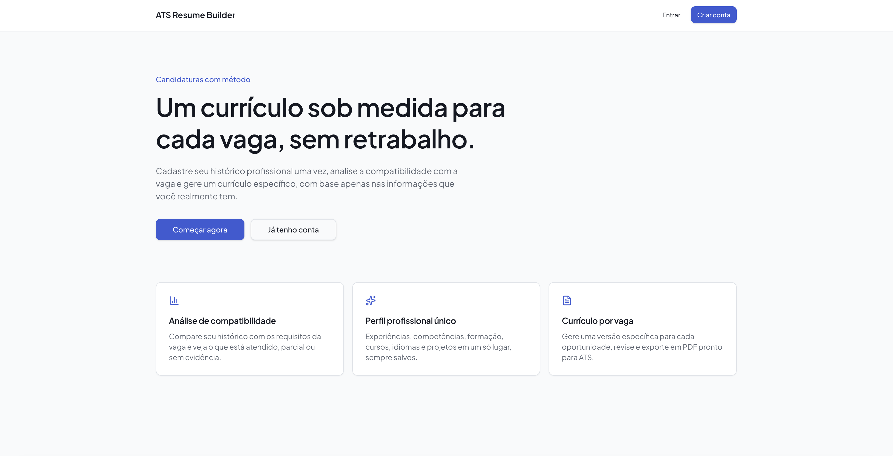

A tela apresenta o objetivo principal da aplicação e direciona o usuário para o fluxo de autenticação.

---

## 2. Dashboard

Após entrar na aplicação, o usuário encontra o dashboard com uma visão geral de suas candidaturas.

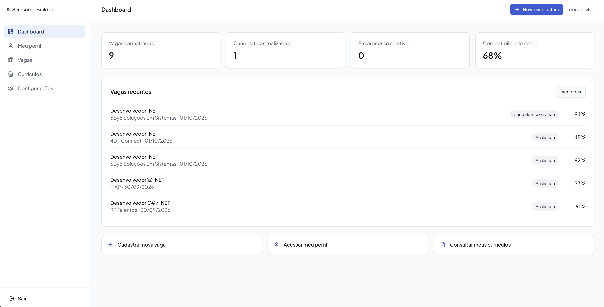

O dashboard apresenta:

- Total de vagas cadastradas;
- Candidaturas realizadas;
- Vagas em processo seletivo;
- Compatibilidade média;
- Vagas recentes.

Também disponibiliza ações rápidas para:

- Cadastrar uma nova vaga;
- Acessar o perfil profissional;
- Consultar os currículos.

---

## 3. Perfil profissional

O perfil profissional funciona como a principal fonte de informações do usuário.

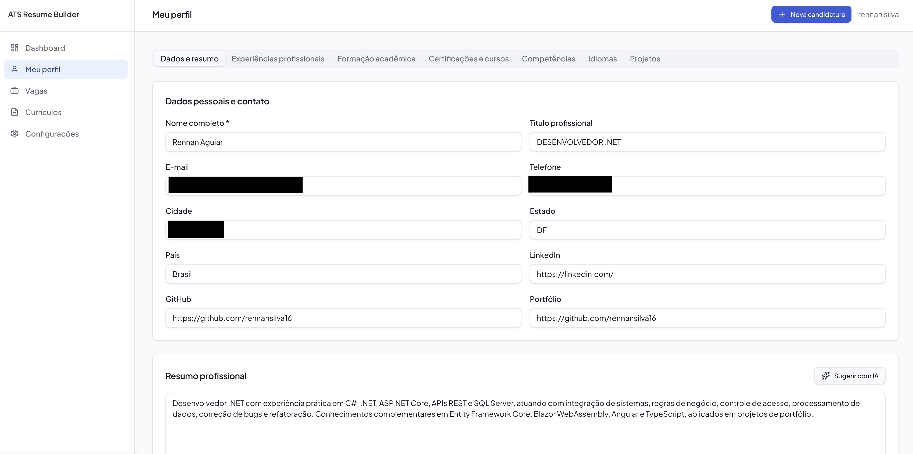

O perfil é dividido em:

- Dados e resumo;
- Experiências profissionais;
- Formação acadêmica;
- Certificações e cursos;
- Competências;
- Idiomas;
- Projetos.

Cada seção possui seus respectivos campos para cadastro, edição e salvamento.

Essas informações podem posteriormente ser reutilizadas em diferentes candidaturas.

---

## 4. Vagas cadastradas

A área de vagas apresenta as oportunidades já cadastradas pelo usuário.

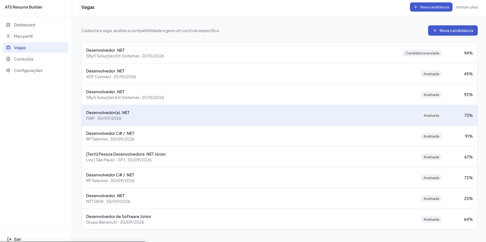

A tela permite consultar as vagas existentes e iniciar o cadastro de uma nova oportunidade.

Cada vaga pode posteriormente ser associada a uma análise de compatibilidade e a um ou mais currículos personalizados.

---

# 🔎 Fluxo de criação e análise de uma candidatura

Além das telas principais, o fluxo de candidatura é a parte central da aplicação.

A seguir, o processo completo é demonstrado desde a escolha da fonte de dados até a exportação do currículo.

---

## 5. Fonte de dados

Ao iniciar uma nova candidatura, o usuário escolhe de onde serão obtidas as informações profissionais.

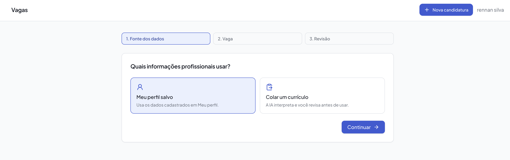

Existem duas possibilidades:

### Utilizar meu perfil salvo

Utiliza as informações já cadastradas na aplicação.

### Colar um currículo

Permite colar o conteúdo de um currículo existente para que a Inteligência Artificial organize as informações.

Essa segunda opção permite trabalhar com um currículo que ainda não foi cadastrado no perfil principal.

---

## 6. Interpretação do currículo

Quando o usuário escolhe colar um currículo, a aplicação disponibiliza uma área de texto para inserir o conteúdo.

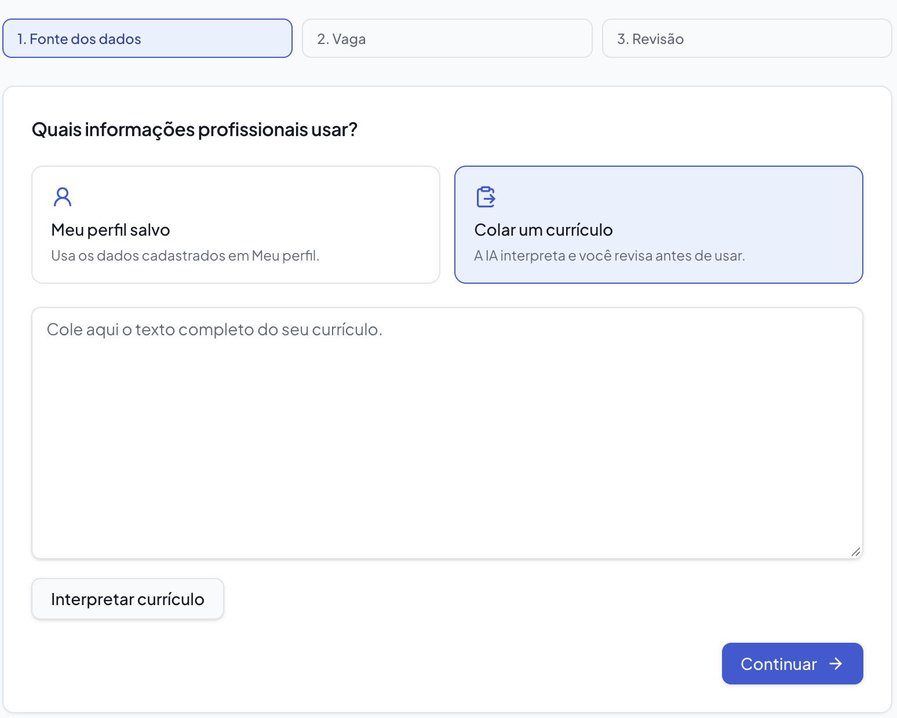

Após clicar em **Interpretar currículo**, a Inteligência Artificial analisa o conteúdo e identifica informações profissionais presentes no documento.

---

## 7. Revisão dos dados extraídos

Depois da interpretação, as informações encontradas são apresentadas em campos estruturados para revisão.

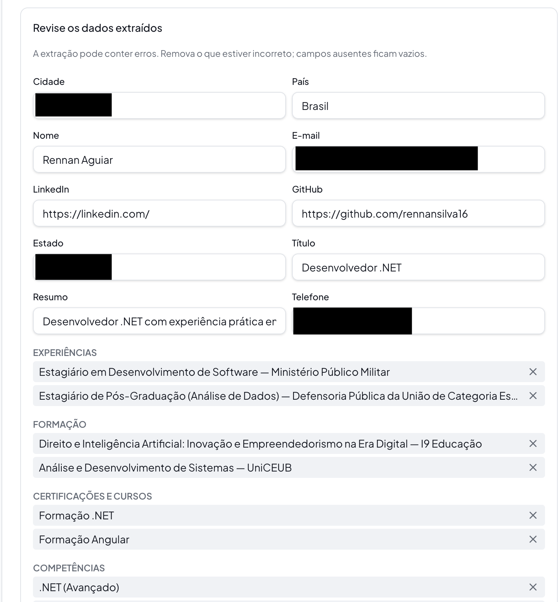
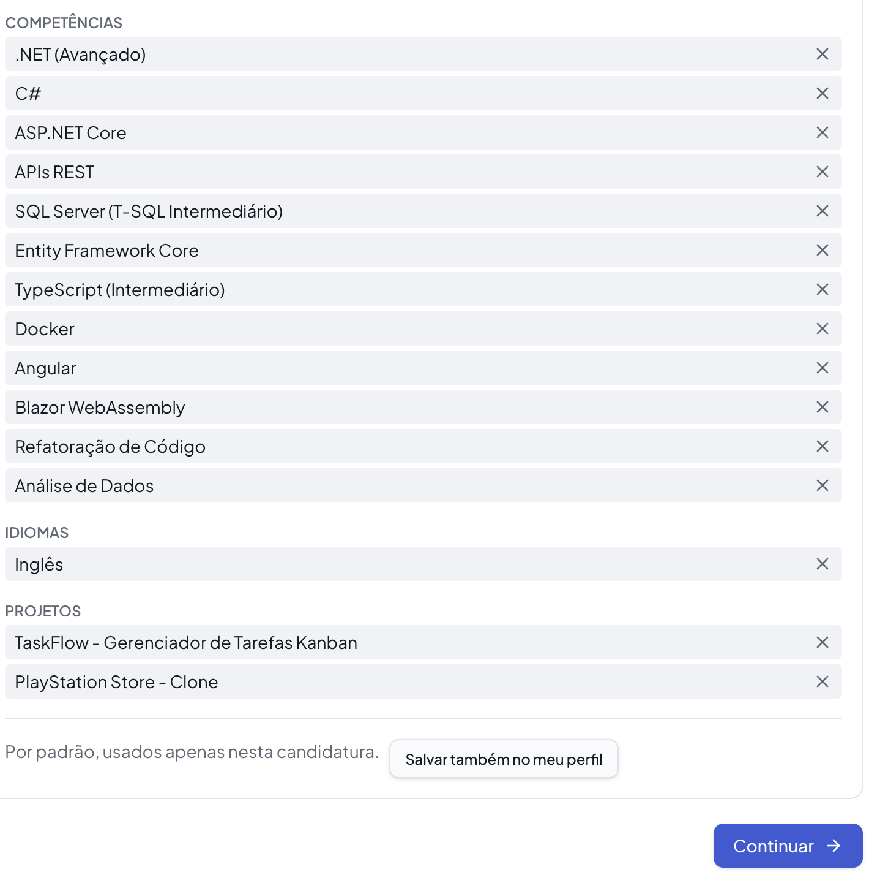

O usuário pode revisar as informações antes de continuar.

Também existe a opção de **Salvar também no meu Perfil**.

Ao selecionar essa opção, a aplicação apresenta as informações encontradas no currículo que ainda não estão cadastradas no perfil.

O usuário pode então escolher quais dados deseja incorporar ao seu perfil principal.

Essa etapa evita que informações sejam adicionadas ao perfil sem confirmação.

---

## 8. Cadastro da vaga

Na etapa seguinte, o usuário informa os dados da oportunidade.

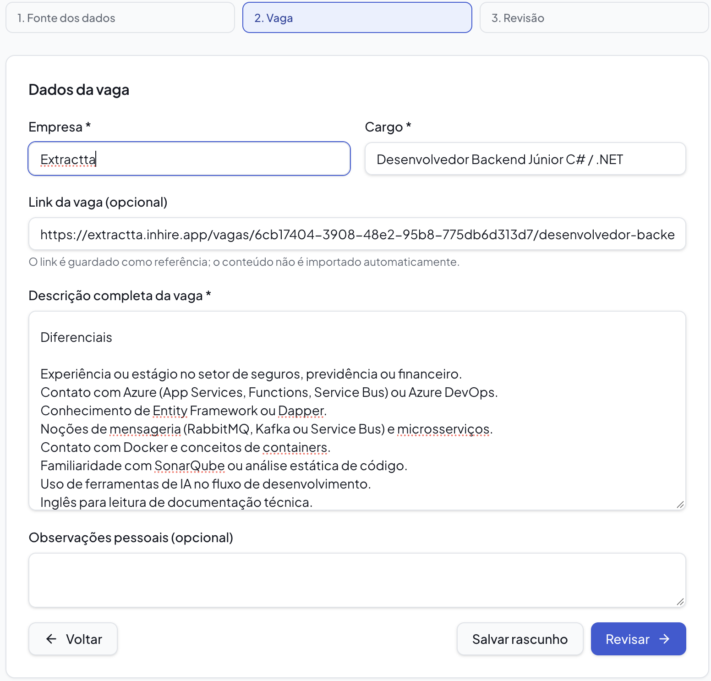

São disponibilizados campos para:

- Título da vaga;
- Nome da empresa;
- Link da vaga;
- Descrição da vaga;
- Observações pessoais.

O usuário pode:

**Salvar rascunho**

ou

**Revisar**

Antes da análise, a aplicação permite revisar as informações cadastradas.

---

## 9. Revisão da vaga

Após preencher os dados, a aplicação apresenta uma revisão da oportunidade cadastrada.

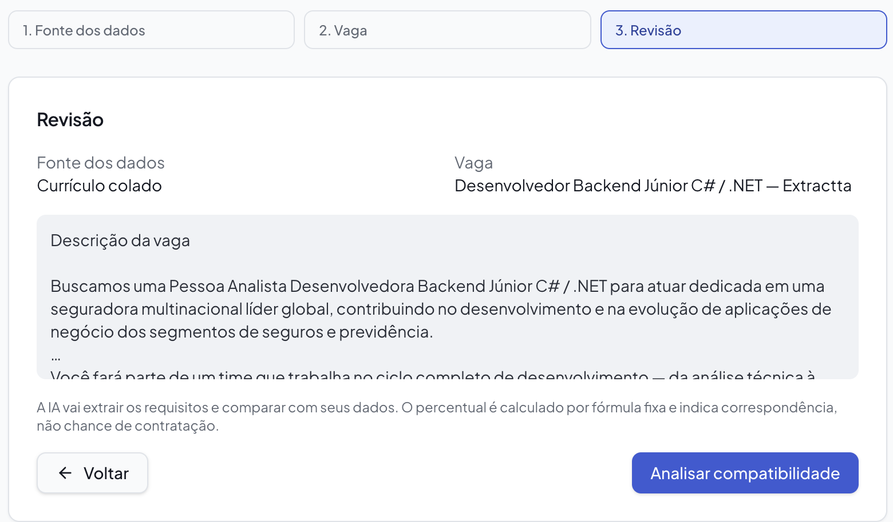

O usuário pode conferir as informações antes de iniciar a análise.

Ao confirmar, utiliza a ação:

**Analisar Compatibilidade**

---

## 10. Resultado da análise de compatibilidade

Esta é uma das principais funcionalidades do projeto.

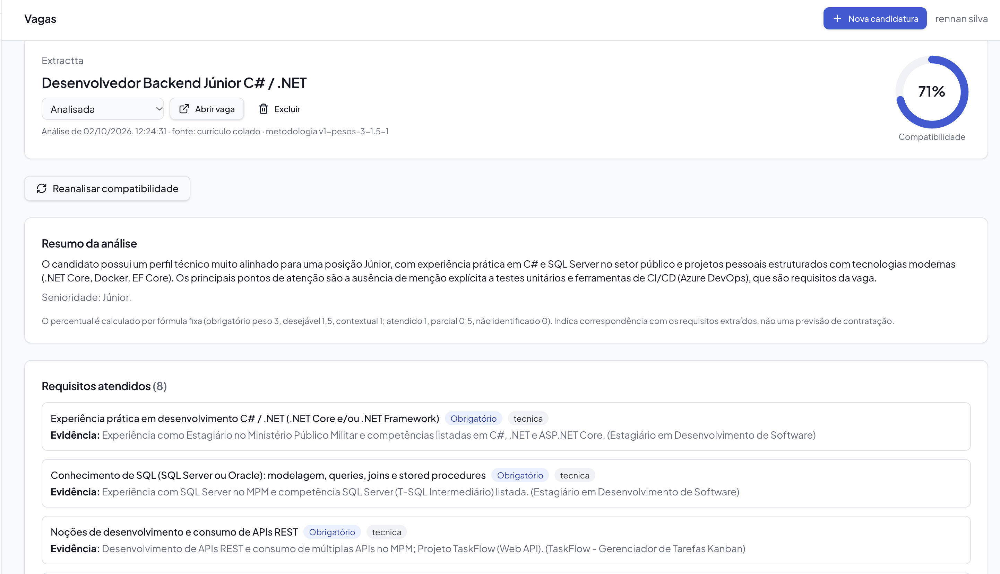

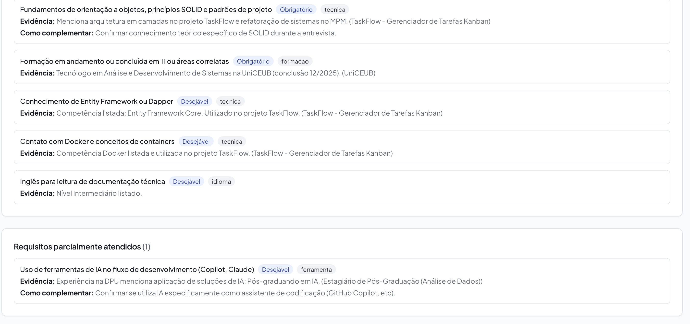

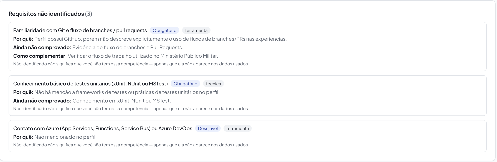

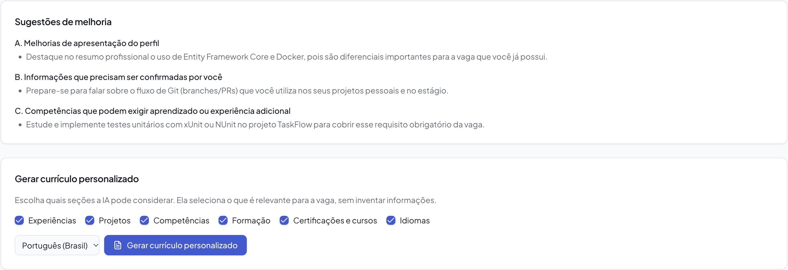

A aplicação apresenta:

- Percentual de compatibilidade;
- Resumo da análise;
- Requisitos atendidos;
- Requisitos parcialmente atendidos;
- Requisitos não identificados;
- Sugestões de melhoria.

O objetivo é permitir que o usuário entenda não apenas o percentual apresentado, mas também **por que determinados requisitos foram considerados atendidos ou não identificados**.

---

## 11. Revisão do currículo

Após analisar a vaga, o usuário pode solicitar a geração de um currículo personalizado.

A aplicação utiliza os dados profissionais e os requisitos identificados na vaga para selecionar e adaptar as informações mais relevantes para aquela oportunidade.

O currículo gerado pode ser editado antes de ser finalizado.

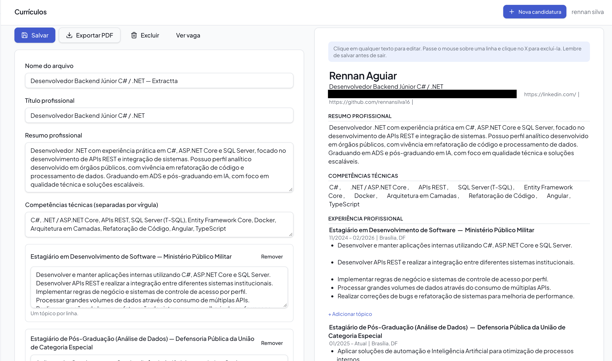

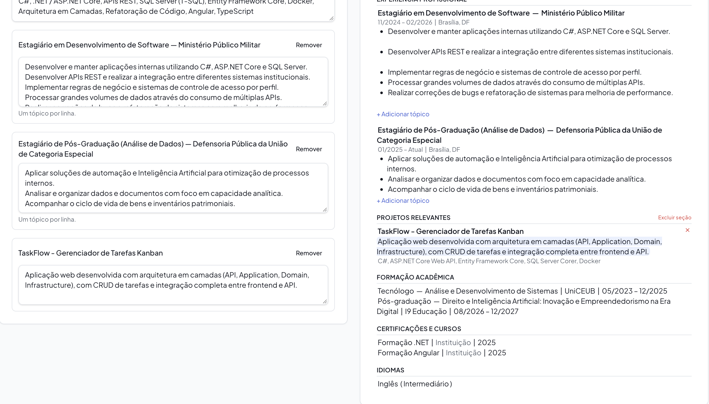


O usuário pode ajustar as informações do documento e conferir o resultado antes de exportá-lo.

Essa etapa mantém o usuário como responsável pela aprovação do conteúdo final.

Depois da revisão, o usuário pode exportar o currículo.

O resultado é um arquivo PDF pronto para utilização em processos seletivos.

---

## 12. Currículos gerados

A área de currículos reúne os documentos que foram criados para as vagas cadastradas.

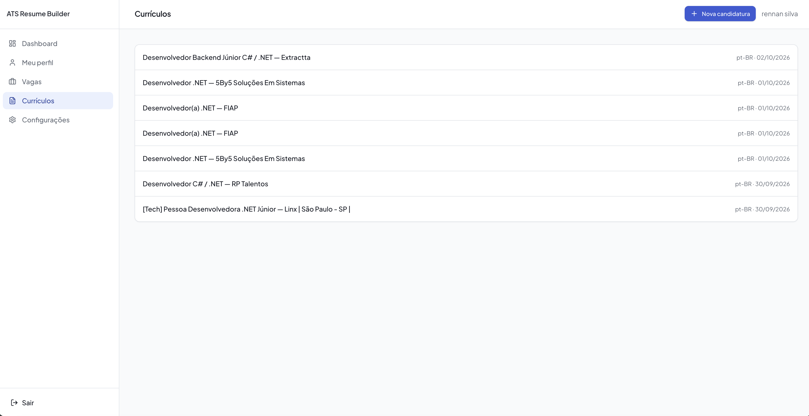

Os currículos ficam associados às respectivas oportunidades, permitindo consultar posteriormente os documentos gerados.

---

# 🧠 Uso de Inteligência Artificial

A Inteligência Artificial é utilizada em diferentes momentos do fluxo.

### 1. Interpretação de currículo

A IA recebe o texto fornecido pelo usuário e identifica informações profissionais estruturáveis.

### 2. Análise da vaga

A IA interpreta a descrição da oportunidade e identifica seus principais requisitos, tecnologias, experiências e competências.

### 3. Comparação com o perfil

Os requisitos identificados são comparados com as informações profissionais utilizadas na candidatura.

### 4. Sugestões de melhoria

A IA identifica pontos que podem ser melhor apresentados ou que precisam de confirmação ou desenvolvimento.

### 5. Geração do currículo

A IA utiliza as informações relevantes para produzir uma versão direcionada à oportunidade.

---

# 🛡️ Regra de integridade das informações

Um dos princípios importantes do projeto é evitar que a Inteligência Artificial invente informações profissionais.

A aplicação não deve criar:

- Experiências profissionais inexistentes;
- Empresas;
- Cargos;
- Tecnologias não utilizadas;
- Certificações;
- Resultados;
- Métricas;
- Tempo de experiência;
- Níveis de domínio;
- Idiomas ou níveis de proficiência.

Quando uma informação não está disponível, a aplicação deve tratar essa ausência como falta de evidência e permitir que o usuário confirme ou complemente os dados.

O objetivo é adaptar o currículo sem transformar a personalização em fabricação de informações.

---

# 🛠️ Tecnologias utilizadas

A aplicação foi desenvolvida utilizando o Lovable e sua stack integrada.

Tecnologias utilizadas no projeto:

- **Lovable** — plataforma utilizada para desenvolvimento da aplicação;
- **React** — construção da interface;
- **TypeScript** — tipagem e desenvolvimento da aplicação;
- **TanStack Start** — estrutura da aplicação;
- **Tailwind CSS** — estilização e design da interface;
- **Supabase** — autenticação e persistência de dados;
- **PostgreSQL** — banco de dados;
- **Inteligência Artificial(`google/gemini-3-flash-preview`)** — interpretação de currículos, análise de vagas e geração de conteúdo;
- **jsPDF** — Geração dos arquivos PDF com texto vetorial puro e legível para sistemas ATS (Applicant Tracking Systems).
- **TanStack Query** — Gerenciamento de cache e sincronização de dados do servidor na interface.
- **Zod** — Validação e tipagem rigorosa de entradas de formulários e payloads de IA.
- **Radix UI / shadcn/ui** — Componentes acessíveis de interface (modais, menus, abas, alertas).

> A stack acima é baseada na estrutura disponibilizada pelo projeto Lovable e nas funcionalidades implementadas na aplicação.

---

# 🧩 Desenvolvimento com Lovable

A aplicação foi construída utilizando o Lovable como ferramenta de desenvolvimento orientada por prompts.

O desenvolvimento ocorreu em duas interações principais.

## Primeira interação

Foi criado um mega prompt, utilizando o ChatGPT, detalhando:

- Contexto do produto;
- Problema;
- Funcionalidades;
- Arquitetura;
- Banco de dados;
- Autenticação;
- Regras de negócio;
- Integração com IA;
- Análise de compatibilidade;
- Geração de currículo;
- Exportação em PDF;
- Segurança;
- Testes;
- Critérios de aceitação;
- Ordem de implementação.

O Lovable iniciou a implementação de maneira incremental e concluiu a primeira fase definida no prompt, criando a estrutura inicial da aplicação, o banco de dados, a autenticação, o dashboard, o layout e as seções principais.

Durante a revisão, foi identificado que as demais fases ainda não haviam sido executadas. Após essa revisão, foi descoberto que o prompt feito pela IA dizia ao Lovable para realizar a implementação em etapas, em diferentes interações.

## Segunda interação

Foi então enviada uma nova instrução solicitando que as fases restantes fossem executadas na mesma interação, mantendo a implementação incremental entre elas, mas sem interromper o processo antes da conclusão da aplicação.

O Lovable executou as fases restantes e concluiu o fluxo funcional previsto para o MVP.

### Aprendizado

Durante o desenvolvimento, foi identificado que a especificação da forma de execução precisava ser mais explícita, pois o erro ocorreu por falta de uma leitura completa do mega prompt feito pelo ChatGPT. Não foi percebido que o prompt indicava que a implementação deveria ser separada por fases.

A intenção era que o desenvolvimento fosse incremental, mas que todas as fases fossem executadas dentro de uma única interação.

A experiência demonstrou a importância de especificar e observar não somente **quais funcionalidades devem ser desenvolvidas**, mas também **como um agente de desenvolvimento deve interpretar a sequência de execução**.

---

# 📚 Documentação do projeto

A documentação complementar está organizada na pasta `docs/`.

- [Mega Prompt](docs/mega-prompt.md) — prompt principal utilizado para orientar a construção da aplicação.
- [Processo de Desenvolvimento](docs/processo-de-desenvolvimento.md) — registro das interações realizadas com o Lovable, decisões e ajustes realizados após a primeira implementação.
- [Roadmap](docs/roadmap.md) — funcionalidades planejadas para futuras versões.

---


# ⚠️ Limitação do repositório

O desenvolvimento da aplicação foi realizado diretamente no Lovable.

No plano utilizado durante o desenvolvimento, a funcionalidade de exportação do código-fonte para um repositório GitHub não estava disponível.

Por esse motivo, este repositório foi criado para documentar o projeto, disponibilizar o mega prompt utilizado na construção, registrar o processo de desenvolvimento e apresentar evidências da aplicação publicada.

A aplicação funcional está disponível no endereço informado no início deste README.

---

# 📦 Entrega

Este repositório foi criado como parte da entrega do projeto desenvolvido no curso **Criando Produtos com IA**, da **Digital Innovation One (DIO)**, em parceria com a **Riachuelo**.

### Aplicação publicada

🌐 **[Acessar o ATS Resume Builder](https://ats-builder-resume.lovable.app/)**

### Repositório

📁 **[GitHub](https://github.com/rennansilva16/ats-builder-resume)**

### Documentação

📄 [Mega Prompt](docs/mega-prompt.md)

📄 [Processo de Desenvolvimento](docs/processo-de-desenvolvimento.md)

📄 [Roadmap](docs/roadmap.md)

---

# 👨‍💻 Projeto

**ATS Resume Builder**

Aplicação desenvolvida com apoio de Inteligência Artificial e Lovable para automatizar e personalizar o processo de criação de currículos direcionados a vagas de emprego.